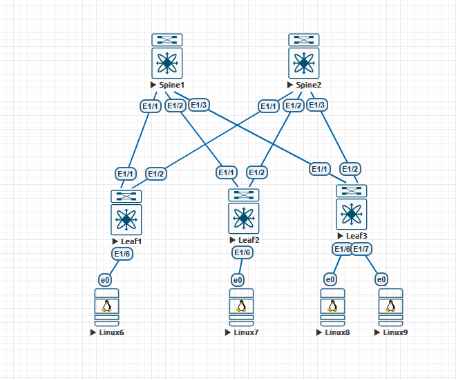

# Домашние задание №2
## Построение Underlay-сети (OSPF)

### Схема сети



## Конфигурация и таблица маршрутизации

<details>
  <summary><b> Spine-1 </b></summary>
  <p> 

```
feature isis

interface Ethernet1/1
  description to Leaf1
  no switchport
  mtu 9000
  no ip redirects
  ip address 10.20.1.0/31
  ip router isis under
  no shutdown

interface Ethernet1/2
  description to Leaf2
  no switchport
  mtu 9000
  no ip redirects
  ip address 10.20.1.2/31
  ip router isis under
  no shutdown

interface Ethernet1/3
  description to Leaf3
  no switchport
  mtu 9000
  no ip redirects
  ip address 10.20.1.4/31
  ip router isis under
  no shutdown

interface loopback1
  ip address 10.10.1.0/32
  ip router isis under

interface loopback2
  ip address 10.11.1.0/32

router isis under
  net 49.0001.1010.0100.0000.00
  is-type level-1
  set-overload-bit on-startup 60
```
### Вывод маршрутной информации
```
10.10.0.1/32, ubest/mbest: 1/0
    *via 10.20.1.1, Eth1/1, [115/41], 00:01:50, isis-under, L1
10.10.0.2/32, ubest/mbest: 1/0
    *via 10.20.1.3, Eth1/2, [115/41], 00:01:33, isis-under, L1
10.10.0.3/32, ubest/mbest: 1/0
    *via 10.20.1.5, Eth1/3, [115/41], 00:01:25, isis-under, L1
10.10.1.0/32, ubest/mbest: 2/0, attached
    *via 10.10.1.0, Lo1, [0/0], 01:28:48, local
    *via 10.10.1.0, Lo1, [0/0], 01:28:48, direct
10.10.2.0/32, ubest/mbest: 3/0
    *via 10.20.1.1, Eth1/1, [115/81], 00:01:42, isis-under, L1
    *via 10.20.1.3, Eth1/2, [115/81], 00:01:33, isis-under, L1
    *via 10.20.1.5, Eth1/3, [115/81], 00:01:23, isis-under, L1
10.11.1.0/32, ubest/mbest: 2/0, attached
    *via 10.11.1.0, Lo2, [0/0], 01:28:48, local
    *via 10.11.1.0, Lo2, [0/0], 01:28:48, direct
10.20.1.0/31, ubest/mbest: 1/0, attached
    *via 10.20.1.0, Eth1/1, [0/0], 01:28:48, direct
10.20.1.0/32, ubest/mbest: 1/0, attached
    *via 10.20.1.0, Eth1/1, [0/0], 01:28:48, local
10.20.1.2/31, ubest/mbest: 1/0, attached
    *via 10.20.1.2, Eth1/2, [0/0], 01:28:48, direct
10.20.1.2/32, ubest/mbest: 1/0, attached
    *via 10.20.1.2, Eth1/2, [0/0], 01:28:48, local
10.20.1.4/31, ubest/mbest: 1/0, attached
    *via 10.20.1.4, Eth1/3, [0/0], 01:28:48, direct
10.20.1.4/32, ubest/mbest: 1/0, attached
    *via 10.20.1.4, Eth1/3, [0/0], 01:28:48, local
10.20.2.0/31, ubest/mbest: 1/0
    *via 10.20.1.1, Eth1/1, [115/80], 00:01:50, isis-under, L1
10.20.2.2/31, ubest/mbest: 1/0
    *via 10.20.1.3, Eth1/2, [115/80], 00:01:33, isis-under, L1
10.20.2.4/31, ubest/mbest: 1/0
    *via 10.20.1.5, Eth1/3, [115/80], 00:01:25, isis-under, L1
```

</p>
</details>

<details>
  <summary><b> Spine-2 </b></summary>
  <p> 

```
feature isis

interface Ethernet1/1
  description to Leaf1
  no switchport
  mtu 9000
  no ip redirects
  ip address 10.20.2.0/31
  ip router isis under
  no shutdown

interface Ethernet1/2
  description to Leaf2
  no switchport
  mtu 9000
  no ip redirects
  ip address 10.20.2.2/31
  ip router isis under
  no shutdown

interface Ethernet1/3
  description to Leaf3
  no switchport
  mtu 9000
  no ip redirects
  ip address 10.20.2.4/31
  ip router isis under
  no shutdown

interface loopback1
  ip address 10.10.2.0/32
  ip router isis under

interface loopback2
  ip address 10.11.2.0/32

router isis under
  net 49.0001.1010.0200.0000.00
  is-type level-1
  set-overload-bit on-startup 60
```
### Вывод маршрутной информации
```
10.10.0.1/32, ubest/mbest: 1/0
    *via 10.20.2.1, Eth1/1, [115/41], 00:01:41, isis-under, L1
10.10.0.2/32, ubest/mbest: 1/0
    *via 10.20.2.3, Eth1/2, [115/41], 00:01:32, isis-under, L1
10.10.0.3/32, ubest/mbest: 1/0
    *via 10.20.2.5, Eth1/3, [115/41], 00:01:23, isis-under, L1
10.10.1.0/32, ubest/mbest: 3/0
    *via 10.20.2.1, Eth1/1, [115/81], 00:01:38, isis-under, L1
    *via 10.20.2.3, Eth1/2, [115/81], 00:01:32, isis-under, L1
    *via 10.20.2.5, Eth1/3, [115/81], 00:01:23, isis-under, L1
10.10.2.0/32, ubest/mbest: 2/0, attached
    *via 10.10.2.0, Lo1, [0/0], 03:34:30, local
    *via 10.10.2.0, Lo1, [0/0], 03:34:30, direct
10.11.2.0/32, ubest/mbest: 2/0, attached
    *via 10.11.2.0, Lo2, [0/0], 03:34:30, local
    *via 10.11.2.0, Lo2, [0/0], 03:34:30, direct
10.20.1.0/31, ubest/mbest: 1/0
    *via 10.20.2.1, Eth1/1, [115/80], 00:01:41, isis-under, L1
10.20.1.2/31, ubest/mbest: 1/0
    *via 10.20.2.3, Eth1/2, [115/80], 00:01:32, isis-under, L1
10.20.1.4/31, ubest/mbest: 1/0
    *via 10.20.2.5, Eth1/3, [115/80], 00:01:23, isis-under, L1
10.20.2.0/31, ubest/mbest: 1/0, attached
    *via 10.20.2.0, Eth1/1, [0/0], 01:31:43, direct
10.20.2.0/32, ubest/mbest: 1/0, attached
    *via 10.20.2.0, Eth1/1, [0/0], 01:31:43, local
10.20.2.2/31, ubest/mbest: 1/0, attached
    *via 10.20.2.2, Eth1/2, [0/0], 01:31:43, direct
10.20.2.2/32, ubest/mbest: 1/0, attached
    *via 10.20.2.2, Eth1/2, [0/0], 01:31:43, local
10.20.2.4/31, ubest/mbest: 1/0, attached
    *via 10.20.2.4, Eth1/3, [0/0], 01:31:42, direct
10.20.2.4/32, ubest/mbest: 1/0, attached
    *via 10.20.2.4, Eth1/3, [0/0], 01:31:42, local
```

</p>
</details>

<details>
  <summary><b> Leaf-1</b></summary>
  <p>
 
```
feature isis

interface Ethernet1/1
  description to Spine1
  no switchport
  mtu 9000
  no ip redirects
  ip address 10.20.1.1/31
  ip router isis under
  no shutdown

interface Ethernet1/2
  description to Spine2
  no switchport
  mtu 9000
  no ip redirects
  ip address 10.20.2.1/31
  ip router isis under
  no shutdown

interface loopback1
  ip address 10.10.0.1/32
  ip router isis under

interface loopback2
  ip address 10.11.0.1/32

router isis under
  net 49.0001.1010.0000.0100.00
  is-type level-1
  set-overload-bit on-startup 60
```
### Вывод маршрутной информации
```
10.10.0.1/32, ubest/mbest: 2/0, attached
    *via 10.10.0.1, Lo1, [0/0], 03:31:24, local
    *via 10.10.0.1, Lo1, [0/0], 03:31:24, direct
10.10.0.2/32, ubest/mbest: 2/0
    *via 10.20.1.0, Eth1/1, [115/81], 00:01:32, isis-under, L1
    *via 10.20.2.0, Eth1/2, [115/81], 00:01:33, isis-under, L1
10.10.0.3/32, ubest/mbest: 2/0
    *via 10.20.1.0, Eth1/1, [115/81], 00:01:24, isis-under, L1
    *via 10.20.2.0, Eth1/2, [115/81], 00:01:22, isis-under, L1
10.10.1.0/32, ubest/mbest: 1/0
    *via 10.20.1.0, Eth1/1, [115/41], 00:01:49, isis-under, L1
10.10.2.0/32, ubest/mbest: 1/0
    *via 10.20.2.0, Eth1/2, [115/41], 00:01:41, isis-under, L1
10.11.0.1/32, ubest/mbest: 2/0, attached
    *via 10.11.0.1, Lo2, [0/0], 03:31:24, local
    *via 10.11.0.1, Lo2, [0/0], 03:31:24, direct
10.20.1.0/31, ubest/mbest: 1/0, attached
    *via 10.20.1.1, Eth1/1, [0/0], 01:31:30, direct
10.20.1.1/32, ubest/mbest: 1/0, attached
    *via 10.20.1.1, Eth1/1, [0/0], 01:31:30, local
10.20.1.2/31, ubest/mbest: 1/0
    *via 10.20.1.0, Eth1/1, [115/80], 00:01:49, isis-under, L1
10.20.1.4/31, ubest/mbest: 1/0
    *via 10.20.1.0, Eth1/1, [115/80], 00:01:49, isis-under, L1
10.20.2.0/31, ubest/mbest: 1/0, attached
    *via 10.20.2.1, Eth1/2, [0/0], 01:31:30, direct
10.20.2.1/32, ubest/mbest: 1/0, attached
    *via 10.20.2.1, Eth1/2, [0/0], 01:31:30, local
10.20.2.2/31, ubest/mbest: 1/0
    *via 10.20.2.0, Eth1/2, [115/80], 00:01:41, isis-under, L1
10.20.2.4/31, ubest/mbest: 1/0
    *via 10.20.2.0, Eth1/2, [115/80], 00:01:41, isis-under, L1

```  
  </p>
</details>

<details>
  <summary><b> Leaf-2</b></summary>
  <p>
 
```
feature isis

interface Ethernet1/1
  description to Spine1
  no switchport
  mtu 9000
  no ip redirects
  ip address 10.20.1.3/31
  ip router isis under
  no shutdown

interface Ethernet1/2
  description to Spine2
  no switchport
  mtu 9000
  no ip redirects
  ip address 10.20.2.3/31
  ip router isis under
  no shutdown

interface loopback1
  ip address 10.10.0.2/32
  ip router isis under

interface loopback2
  ip address 10.11.0.2/32

router isis under
  net 49.0001.1010.0000.0200.00
  is-type level-1
  set-overload-bit on-startup 60
```
### Вывод маршрутной информации
```
10.10.0.1/32, ubest/mbest: 2/0
    *via 10.20.1.2, Eth1/1, [115/81], 00:01:31, isis-under, L1
    *via 10.20.2.2, Eth1/2, [115/81], 00:01:31, isis-under, L1
10.10.0.2/32, ubest/mbest: 2/0, attached
    *via 10.10.0.2, Lo1, [0/0], 03:31:15, local
    *via 10.10.0.2, Lo1, [0/0], 03:31:15, direct
10.10.0.3/32, ubest/mbest: 2/0
    *via 10.20.1.2, Eth1/1, [115/81], 00:01:23, isis-under, L1
    *via 10.20.2.2, Eth1/2, [115/81], 00:01:21, isis-under, L1
10.10.1.0/32, ubest/mbest: 1/0
    *via 10.20.1.2, Eth1/1, [115/41], 00:01:32, isis-under, L1
10.10.2.0/32, ubest/mbest: 1/0
    *via 10.20.2.2, Eth1/2, [115/41], 00:01:33, isis-under, L1
10.11.0.2/32, ubest/mbest: 2/0, attached
    *via 10.11.0.2, Lo2, [0/0], 03:31:15, local
    *via 10.11.0.2, Lo2, [0/0], 03:31:15, direct
10.20.1.0/31, ubest/mbest: 1/0
    *via 10.20.1.2, Eth1/1, [115/80], 00:01:32, isis-under, L1
10.20.1.2/31, ubest/mbest: 1/0, attached
    *via 10.20.1.3, Eth1/1, [0/0], 01:31:20, direct
10.20.1.3/32, ubest/mbest: 1/0, attached
    *via 10.20.1.3, Eth1/1, [0/0], 01:31:20, local
10.20.1.4/31, ubest/mbest: 1/0
    *via 10.20.1.2, Eth1/1, [115/80], 00:01:32, isis-under, L1
10.20.2.0/31, ubest/mbest: 1/0
    *via 10.20.2.2, Eth1/2, [115/80], 00:01:33, isis-under, L1
10.20.2.2/31, ubest/mbest: 1/0, attached
    *via 10.20.2.3, Eth1/2, [0/0], 01:31:19, direct
10.20.2.3/32, ubest/mbest: 1/0, attached
    *via 10.20.2.3, Eth1/2, [0/0], 01:31:19, local
10.20.2.4/31, ubest/mbest: 1/0
    *via 10.20.2.2, Eth1/2, [115/80], 00:01:33, isis-under, L1
```  
  </p>
</details>

<details>
  <summary><b> Leaf-3</b></summary>
  <p>
 
```
feature isis

interface Ethernet1/1
  description to Spine1
  no switchport
  mtu 9000
  no ip redirects
  ip address 10.20.1.5/31
  ip router isis under
  no shutdown

interface Ethernet1/2
  description to Spine2
  no switchport
  mtu 9000
  no ip redirects
  ip address 10.20.2.5/31
  ip router isis under
  no shutdown

interface loopback1
  ip address 10.10.0.3/32
  ip router isis under

interface loopback2
  ip address 10.11.0.3/32

router isis under
  net 49.0001.1010.0000.0300.00
  is-type level-1
  set-overload-bit on-startup 60
```
### Вывод маршрутной информации
```
10.10.0.1/32, ubest/mbest: 2/0
    *via 10.20.1.4, Eth1/1, [115/81], 00:01:24, isis-under, L1
    *via 10.20.2.4, Eth1/2, [115/81], 00:01:24, isis-under, L1
10.10.0.2/32, ubest/mbest: 2/0
    *via 10.20.1.4, Eth1/1, [115/81], 00:01:24, isis-under, L1
    *via 10.20.2.4, Eth1/2, [115/81], 00:01:24, isis-under, L1
10.10.0.3/32, ubest/mbest: 2/0, attached
    *via 10.10.0.3, Lo1, [0/0], 03:31:02, local
    *via 10.10.0.3, Lo1, [0/0], 03:31:02, direct
10.10.1.0/32, ubest/mbest: 1/0
    *via 10.20.1.4, Eth1/1, [115/41], 00:01:25, isis-under, L1
10.10.2.0/32, ubest/mbest: 1/0
    *via 10.20.2.4, Eth1/2, [115/41], 00:01:24, isis-under, L1
10.11.0.3/32, ubest/mbest: 2/0, attached
    *via 10.11.0.3, Lo2, [0/0], 03:31:02, local
    *via 10.11.0.3, Lo2, [0/0], 03:31:02, direct
10.20.1.0/31, ubest/mbest: 1/0
    *via 10.20.1.4, Eth1/1, [115/80], 00:01:25, isis-under, L1
10.20.1.2/31, ubest/mbest: 1/0
    *via 10.20.1.4, Eth1/1, [115/80], 00:01:25, isis-under, L1
10.20.1.4/31, ubest/mbest: 1/0, attached
    *via 10.20.1.5, Eth1/1, [0/0], 01:31:12, direct
10.20.1.5/32, ubest/mbest: 1/0, attached
    *via 10.20.1.5, Eth1/1, [0/0], 01:31:12, local
10.20.2.0/31, ubest/mbest: 1/0
    *via 10.20.2.4, Eth1/2, [115/80], 00:01:24, isis-under, L1
10.20.2.2/31, ubest/mbest: 1/0
    *via 10.20.2.4, Eth1/2, [115/80], 00:01:24, isis-under, L1
10.20.2.4/31, ubest/mbest: 1/0, attached
    *via 10.20.2.5, Eth1/2, [0/0], 01:31:11, direct
10.20.2.5/32, ubest/mbest: 1/0, attached
    *via 10.20.2.5, Eth1/2, [0/0], 01:31:11, local
```  
  </p>
</details>

