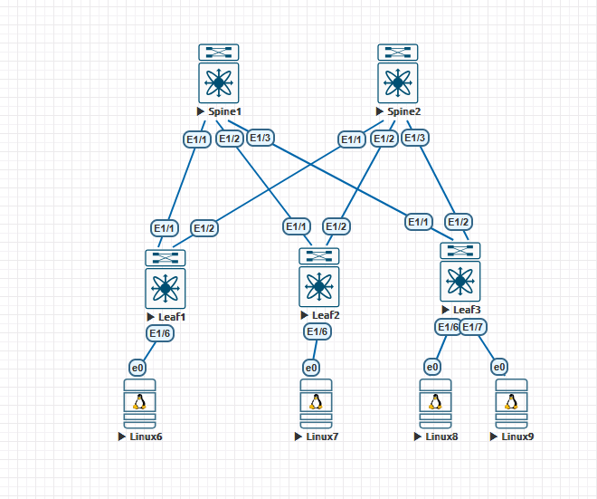

# Домашние задание №4
## Построение Underlay-сети (eBGP)

### Схема сети



## Конфигурация и таблица маршрутизации

<details>
  <summary><b> Spine-1 </b></summary>
  <p> 

```
feature bgp

route-map leaf-ases permit 10
 match as-number 65301-65399 

interface Ethernet1/1
 no switchport
 mtu 9216
 no ip redirects
 ip address 10.20.1.0/31
 no shutdown

interface Ethernet1/2
 no switchport
 mtu 9216
 no ip redirects
 ip address 10.20.1.2/31
 no shutdown

interface Ethernet1/3
 no switchport
 mtu 9216
 no ip redirects
 ip address 10.20.1.4/31
 no shutdown

interface loopback0
 ip address 10.10.1.0/32

router bgp 65000
router-id 10.10.1.0
bestpath as-path multipath-relax
address-family ipv4 unicast
 network 10.10.1.0/32
 maximum-paths 10
template peer-policy dc1
 send-community
 send-community extended
template peer-session Leaf
 timers 1 3
neighbor 10.20.0.0/16 remote-as route-map leaf-ases
 inherit peer dc1
 inherit peer-session Leaf
 address-family ipv4 unicast
```
### Вывод маршрутной информации
```
10.10.1.0/32, ubest/mbest: 2/0, attached
    *via 10.10.1.0, Lo1, [0/0], 02:16:39, local
    *via 10.10.1.0, Lo1, [0/0], 02:16:39, direct
10.11.0.1/32, ubest/mbest: 1/0
    *via 10.20.1.1, [20/0], 00:02:23, bgp-65000, external, tag 65301
10.11.0.2/32, ubest/mbest: 1/0
    *via 10.20.1.3, [20/0], 00:02:05, bgp-65000, external, tag 65302
10.11.0.3/32, ubest/mbest: 1/0
    *via 10.20.1.5, [20/0], 00:01:47, bgp-65000, external, tag 65303
10.11.1.0/32, ubest/mbest: 2/0, attached
    *via 10.11.1.0, Lo2, [0/0], 02:16:39, local
    *via 10.11.1.0, Lo2, [0/0], 02:16:39, direct
10.20.1.0/31, ubest/mbest: 1/0, attached
    *via 10.20.1.0, Eth1/1, [0/0], 02:16:39, direct
10.20.1.0/32, ubest/mbest: 1/0, attached
    *via 10.20.1.0, Eth1/1, [0/0], 02:16:39, local
10.20.1.2/31, ubest/mbest: 1/0, attached
    *via 10.20.1.2, Eth1/2, [0/0], 02:16:39, direct
10.20.1.2/32, ubest/mbest: 1/0, attached
    *via 10.20.1.2, Eth1/2, [0/0], 02:16:39, local
10.20.1.4/31, ubest/mbest: 1/0, attached
    *via 10.20.1.4, Eth1/3, [0/0], 02:16:39, direct
10.20.1.4/32, ubest/mbest: 1/0, attached
    *via 10.20.1.4, Eth1/3, [0/0], 02:16:39, local
```
### Соседи spine1
```
Neighbor        V    AS    MsgRcvd    MsgSent   TblVer  InQ OutQ Up/Down  State/
PfxRcd
10.20.1.1       4 65301       1061       1060       10    0    0 00:17:35 1     
    
10.20.1.3       4 65302       1036       1035       10    0    0 00:17:10 1     
    
10.20.1.5       4 65303       1027       1025       10    0    0 00:16:59 1     
```
</p>
</details>

<details>
  <summary><b> Spine-2 </b></summary>
  <p> 

```
feature bgp

route-map leaf-ases permit 10
  match as-number 65301-65399


interface Ethernet1/1
 no switchport
 mtu 9216
 ip address 10.20.2.0/31
 no shutdown

interface Ethernet1/2
 no switchport
 mtu 9216
 ip address 10.20.2.2/31
 no shutdown

interface Ethernet1/3
 no switchport
 mtu 9216
 ip address 10.20.2.4/31
 no shutdown

interface loopback0
 ip address 10.10.2.0/32

router bgp 65000
  router-id 10.10.2.0
  bestpath as-path multipath-relax
  address-family ipv4 unicast
    network 10.10.2.0/32
    maximum-paths 10
  template peer-policy dc1
    send-community
    send-community extended
  template peer-session Leaf
    timers 1 3
  neighbor 10.20.0.0/16 remote-as route-map leaf-ases
    inherit peer dc1
    inherit peer-session Leaf
    address-family ipv4 unicast
```
### Вывод маршрутной информации
```
10.10.2.0/32, ubest/mbest: 2/0, attached
    *via 10.10.2.0, Lo1, [0/0], 04:22:21, local
    *via 10.10.2.0, Lo1, [0/0], 04:22:21, direct
10.11.0.1/32, ubest/mbest: 1/0
    *via 10.20.2.1, [20/0], 00:02:22, bgp-65000, external, tag 65301
10.11.0.2/32, ubest/mbest: 1/0
    *via 10.20.2.3, [20/0], 00:02:05, bgp-65000, external, tag 65302
10.11.0.3/32, ubest/mbest: 1/0
    *via 10.20.2.5, [20/0], 00:01:47, bgp-65000, external, tag 65303
10.11.2.0/32, ubest/mbest: 2/0, attached
    *via 10.11.2.0, Lo2, [0/0], 04:22:21, local
    *via 10.11.2.0, Lo2, [0/0], 04:22:21, direct
10.20.2.0/31, ubest/mbest: 1/0, attached
    *via 10.20.2.0, Eth1/1, [0/0], 02:19:34, direct
10.20.2.0/32, ubest/mbest: 1/0, attached
    *via 10.20.2.0, Eth1/1, [0/0], 02:19:34, local
10.20.2.2/31, ubest/mbest: 1/0, attached
    *via 10.20.2.2, Eth1/2, [0/0], 02:19:34, direct
10.20.2.2/32, ubest/mbest: 1/0, attached
    *via 10.20.2.2, Eth1/2, [0/0], 02:19:34, local
10.20.2.4/31, ubest/mbest: 1/0, attached
    *via 10.20.2.4, Eth1/3, [0/0], 02:19:33, direct
10.20.2.4/32, ubest/mbest: 1/0, attached
    *via 10.20.2.4, Eth1/3, [0/0], 02:19:33, local
```
### Соседи spine2
```
Neighbor        V    AS    MsgRcvd    MsgSent   TblVer  InQ OutQ Up/Down  State/
PfxRcd
10.20.2.1       4 65301       1053       1052       10    0    0 00:17:26 1     
    
10.20.2.3       4 65302       1037       1036       10    0    0 00:17:10 1     
    
10.20.2.5       4 65303       1026       1025       10    0    0 00:16:59 1     
```
</p>
</details>

<details>
  <summary><b> Leaf-1</b></summary>
  <p>
 
```
feature bgp

interface Ethernet1/1
 no switchport
 mtu 9216
 no ip redirects
 ip address 10.20.1.1/31
 no shutdown

interface Ethernet1/2
 no switchport
 mtu 9216
 no ip redirects
 ip address 10.20.2.1/31
 no shutdown

interface loopback1
 ip address 10.10.0.1/32

router bgp 65301
 router-id 10.10.0.1
 bestpath as-path multipath-relax
 address-family ipv4 unicast
  network 10.10.0.1/32
  maximum-paths 10
 template peer-policy dc1
  send-community
  send-community extended
 template peer-session Spine
  remote-as 65000
  timers 1 3
 neighbor 10.20.1.0
  inherit peer dc1
  inherit peer-session Spine
  address-family ipv4 unicast
 neighbor 10.20.2.0
  inherit peer dc1
  inherit peer-session Spine
  address-family ipv4 unicast
```
### Вывод маршрутной информации
```
10.10.0.1/32, ubest/mbest: 2/0, attached
    *via 10.10.0.1, Lo1, [0/0], 04:19:15, local
    *via 10.10.0.1, Lo1, [0/0], 04:19:15, direct
10.10.1.0/32, ubest/mbest: 1/0
    *via 10.20.1.0, [20/0], 00:29:30, bgp-65301, external, tag 65000
10.10.2.0/32, ubest/mbest: 1/0
    *via 10.20.2.0, [20/0], 00:29:22, bgp-65301, external, tag 65000
10.11.0.1/32, ubest/mbest: 2/0, attached
    *via 10.11.0.1, Lo2, [0/0], 04:19:15, local
    *via 10.11.0.1, Lo2, [0/0], 04:19:15, direct
10.11.0.2/32, ubest/mbest: 2/0
    *via 10.20.1.0, [20/0], 00:02:05, bgp-65301, external, tag 65000
    *via 10.20.2.0, [20/0], 00:02:05, bgp-65301, external, tag 65000
10.11.0.3/32, ubest/mbest: 2/0
    *via 10.20.1.0, [20/0], 00:01:47, bgp-65301, external, tag 65000
    *via 10.20.2.0, [20/0], 00:01:47, bgp-65301, external, tag 65000
10.20.1.0/31, ubest/mbest: 1/0, attached
    *via 10.20.1.1, Eth1/1, [0/0], 02:19:21, direct
10.20.1.1/32, ubest/mbest: 1/0, attached
    *via 10.20.1.1, Eth1/1, [0/0], 02:19:21, local
10.20.2.0/31, ubest/mbest: 1/0, attached
    *via 10.20.2.1, Eth1/2, [0/0], 02:19:21, direct
10.20.2.1/32, ubest/mbest: 1/0, attached
    *via 10.20.2.1, Eth1/2, [0/0], 02:19:21, local
```  
### Соседи leaf1
```
Neighbor        V    AS    MsgRcvd    MsgSent   TblVer  InQ OutQ Up/Down  State/
PfxRcd
10.20.1.0       4 65000       1063       1060       12    0    0 00:17:35 3     
    
10.20.2.0       4 65000       1055       1052       12    0    0 00:17:26 3   
```
  </p>
</details>

<details>
  <summary><b> Leaf-2</b></summary>
  <p>
 
```
feature bgp

interface Ethernet1/1
 no switchport
 mtu 9216
 ip address 10.20.1.3/31
 no shutdown

interface Ethernet1/2
 no switchport
 mtu 9216
 ip address 10.20.2.3/31
 no shutdown

interface loopback1
 ip address 10.10.0.2/32

router bgp 65302
router-id 10.10.0.2
bestpath as-path multipath-relax
address-family ipv4 unicast
 network 10.10.0.2/32
 maximum-paths 10
template peer-policy dc1
 send-community
 send-community extended
template peer-session Spine
 remote-as 65000
 timers 1 3
neighbor 10.20.1.2
 inherit peer dc1
 inherit peer-session Spine
 address-family ipv4 unicast
neighbor 10.20.2.2
 inherit peer dc1
 inherit peer-session Spine
 address-family ipv4 unicast
```
### Вывод маршрутной информации
```
10.10.0.2/32, ubest/mbest: 2/0, attached
    *via 10.10.0.2, Lo1, [0/0], 04:19:07, local
    *via 10.10.0.2, Lo1, [0/0], 04:19:07, direct
10.10.1.0/32, ubest/mbest: 1/0
    *via 10.20.1.2, [20/0], 00:29:06, bgp-65302, external, tag 65000
10.10.2.0/32, ubest/mbest: 1/0
    *via 10.20.2.2, [20/0], 00:29:06, bgp-65302, external, tag 65000
10.11.0.1/32, ubest/mbest: 2/0
    *via 10.20.1.2, [20/0], 00:02:23, bgp-65302, external, tag 65000
    *via 10.20.2.2, [20/0], 00:02:23, bgp-65302, external, tag 65000
10.11.0.2/32, ubest/mbest: 2/0, attached
    *via 10.11.0.2, Lo2, [0/0], 04:19:07, local
    *via 10.11.0.2, Lo2, [0/0], 04:19:07, direct
10.11.0.3/32, ubest/mbest: 2/0
    *via 10.20.1.2, [20/0], 00:01:47, bgp-65302, external, tag 65000
    *via 10.20.2.2, [20/0], 00:01:47, bgp-65302, external, tag 65000
10.20.1.2/31, ubest/mbest: 1/0, attached
    *via 10.20.1.3, Eth1/1, [0/0], 02:19:12, direct
10.20.1.3/32, ubest/mbest: 1/0, attached
    *via 10.20.1.3, Eth1/1, [0/0], 02:19:12, local
10.20.2.2/31, ubest/mbest: 1/0, attached
    *via 10.20.2.3, Eth1/2, [0/0], 02:19:11, direct
10.20.2.3/32, ubest/mbest: 1/0, attached
    *via 10.20.2.3, Eth1/2, [0/0], 02:19:11, local
```  
### Соседи leaf2
```
Neighbor        V    AS    MsgRcvd    MsgSent   TblVer  InQ OutQ Up/Down  State/
PfxRcd
10.20.1.2       4 65000       1038       1035       12    0    0 00:17:10 3     
    
10.20.2.2       4 65000       1039       1036       12    0    0 00:17:10 3       
```
  </p>
</details>

<details>
  <summary><b> Leaf-3</b></summary>
  <p>
 
```
feature bgp

interface Ethernet1/1
 no switchport
 mtu 9216
 ip address 10.20.1.5/31
 no shutdown

interface Ethernet1/2
 no switchport
 mtu 9216
 ip address 10.20.2.5/31
 no shutdown

interface loopback1
 ip address 10.10.0.3/32

router bgp 65303
 router-id 10.10.0.3
 bestpath as-path multipath-relax
 address-family ipv4 unicast
   network 10.10.0.3/32
   maximum-paths 10
 template peer-policy dc1
   send-community
   send-community extended
 template peer-session Spine
   remote-as 65000
   timers 1 3
 neighbor 10.20.1.4
   inherit peer dc1
   inherit peer-session Spine
   address-family ipv4 unicast
 neighbor 10.20.2.4
   inherit peer dc1
   inherit peer-session Spine
   address-family ipv4 unicast
```
### Вывод маршрутной информации
```
10.10.0.3/32, ubest/mbest: 2/0, attached
    *via 10.10.0.3, Lo1, [0/0], 04:18:53, local
    *via 10.10.0.3, Lo1, [0/0], 04:18:53, direct
10.10.1.0/32, ubest/mbest: 1/0
    *via 10.20.1.4, [20/0], 00:28:55, bgp-65303, external, tag 65000
10.10.2.0/32, ubest/mbest: 1/0
    *via 10.20.2.4, [20/0], 00:28:55, bgp-65303, external, tag 65000
10.11.0.1/32, ubest/mbest: 2/0
    *via 10.20.1.4, [20/0], 00:02:23, bgp-65303, external, tag 65000
    *via 10.20.2.4, [20/0], 00:02:23, bgp-65303, external, tag 65000
10.11.0.2/32, ubest/mbest: 2/0
    *via 10.20.1.4, [20/0], 00:02:05, bgp-65303, external, tag 65000
    *via 10.20.2.4, [20/0], 00:02:05, bgp-65303, external, tag 65000
10.11.0.3/32, ubest/mbest: 2/0, attached
    *via 10.11.0.3, Lo2, [0/0], 04:18:53, local
    *via 10.11.0.3, Lo2, [0/0], 04:18:53, direct
10.20.1.4/31, ubest/mbest: 1/0, attached
    *via 10.20.1.5, Eth1/1, [0/0], 02:19:03, direct
10.20.1.5/32, ubest/mbest: 1/0, attached
    *via 10.20.1.5, Eth1/1, [0/0], 02:19:03, local
10.20.2.4/31, ubest/mbest: 1/0, attached
    *via 10.20.2.5, Eth1/2, [0/0], 02:19:02, direct
10.20.2.5/32, ubest/mbest: 1/0, attached
    *via 10.20.2.5, Eth1/2, [0/0], 02:19:02, local
```  
### Соседи leaf3
```
Neighbor        V    AS    MsgRcvd    MsgSent   TblVer  InQ OutQ Up/Down  State/
PfxRcd
10.20.1.4       4 65000       1028       1026       12    0    0 00:16:59 3     
    
10.20.2.4       4 65000       1028       1025       12    0    0 00:16:59 3         
```
  </p>
</details>

