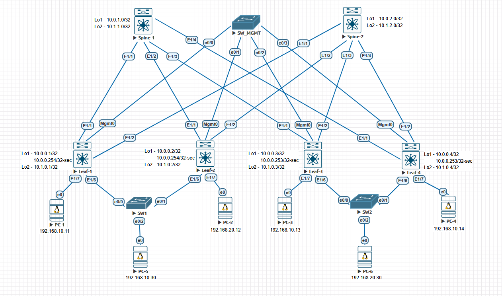

# Домашние задание №7
## VPC

### Схема сети



## Конфигурация и таблица маршрутизации

<details>
  <summary><b> Spine-1 </b></summary>
  <p> 

```
nv overlay evpn
feature bgp

route-map leaf-ases permit 10
 match as-number 65301-65399 
route-map nhu permit 10
  set ip next-hop unchanged
route-map redis permit 10
  match interface loopback0 loopback1

interface Ethernet1/1
 no switchport
 mtu 9216
 port-type fabric
 no ip redirects
 ip address 10.20.1.0/31
 no shutdown

interface Ethernet1/2
 no switchport
 mtu 9216
 port-type fabric
 no ip redirects
 ip address 10.20.1.2/31
 no shutdown

interface Ethernet1/3
 no switchport
 mtu 9216
 port-type fabric
 no ip redirects
 ip address 10.20.1.4/31
 no shutdown

interface loopback0
 ip address 10.10.1.0/32

interface loopback1
 ip address 10.11.1.0/32

router bgp 65000
 router-id 10.10.1.0
 timers bgp 3 9
 reconnect-interval 12
 log-neighbor-changes
 address-family ipv4 unicast
  redistribute direct route-map redis
  maximum-paths 10
 address-family l2vpn evpn
  maximum-paths 10
  retain route-target all
 neighbor 10.10.0.0/24 remote-as route-map leaf-ases
  remote-as external
  update-source loopback0
  ebgp-multihop 5
  address-family l2vpn evpn
    send-community
    send-community extended
    route-map nhu out
    rewrite-evpn-rt-asn
 neighbor 10.20.1.0/24 remote-as route-map leaf-ases
  address-family ipv4 unicast
```
### Вывод маршрутной информации
```
10.10.0.1/32, ubest/mbest: 1/0
    *via 10.20.1.1, [20/0], 00:37:19, bgp-65000, external, tag 65301
10.10.0.2/32, ubest/mbest: 1/0
    *via 10.20.1.3, [20/0], 00:30:33, bgp-65000, external, tag 65302
10.10.0.3/32, ubest/mbest: 1/0
    *via 10.20.1.5, [20/0], 00:33:57, bgp-65000, external, tag 65303
10.10.1.0/32, ubest/mbest: 2/0, attached
    *via 10.10.1.0, Lo0, [0/0], 00:41:14, local
    *via 10.10.1.0, Lo0, [0/0], 00:41:14, direct
10.11.0.1/32, ubest/mbest: 1/0
    *via 10.20.1.1, [20/0], 00:37:19, bgp-65000, external, tag 65301
10.11.0.2/32, ubest/mbest: 1/0
    *via 10.20.1.3, [20/0], 00:30:33, bgp-65000, external, tag 65302
10.11.0.3/32, ubest/mbest: 1/0
    *via 10.20.1.5, [20/0], 00:33:57, bgp-65000, external, tag 65303
10.11.1.0/32, ubest/mbest: 2/0, attached
    *via 10.11.1.0, Lo1, [0/0], 00:41:13, local
    *via 10.11.1.0, Lo1, [0/0], 00:41:13, direct
10.20.1.0/31, ubest/mbest: 1/0, attached
    *via 10.20.1.0, Eth1/1, [0/0], 00:41:41, direct
10.20.1.0/32, ubest/mbest: 1/0, attached
    *via 10.20.1.0, Eth1/1, [0/0], 00:41:41, local
10.20.1.2/31, ubest/mbest: 1/0, attached
    *via 10.20.1.2, Eth1/2, [0/0], 00:41:40, direct
10.20.1.2/32, ubest/mbest: 1/0, attached
    *via 10.20.1.2, Eth1/2, [0/0], 00:41:40, local
10.20.1.4/31, ubest/mbest: 1/0, attached
    *via 10.20.1.4, Eth1/3, [0/0], 00:41:40, direct
10.20.1.4/32, ubest/mbest: 1/0, attached
    *via 10.20.1.4, Eth1/3, [0/0], 00:41:40, local
```
### L2VPN EVPN
```
spine1#  show bgp l2vpn evpn
BGP routing table information for VRF default, address family L2VPN EVPN
BGP table version is 257, Local Router ID is 10.10.1.0
Status: s-suppressed, x-deleted, S-stale, d-dampened, h-history, *-valid, >-best
Path type: i-internal, e-external, c-confed, l-local, a-aggregate, r-redist, I-i
njected
Origin codes: i - IGP, e - EGP, ? - incomplete, | - multipath, & - backup, 2 - b
est2

   Network            Next Hop            Metric     LocPrf     Weight Path
Route Distinguisher: 10.10.0.1:32777
*>e[2]:[0]:[0]:[48]:[0050.0000.0600]:[0]:[0.0.0.0]/216
                      10.10.0.1                                      0 65301 i
*>e[2]:[0]:[0]:[48]:[0050.0000.0600]:[32]:[192.168.10.11]/272
                      10.10.0.1                                      0 65301 i
*>e[3]:[0]:[32]:[10.10.0.1]/88
                      10.10.0.1                                      0 65301 i

Route Distinguisher: 10.10.0.1:32787
*>e[3]:[0]:[32]:[10.10.0.1]/88
                      10.10.0.1                                      0 65301 i

Route Distinguisher: 10.10.0.2:32777
*>e[2]:[0]:[0]:[48]:[0050.0000.0700]:[0]:[0.0.0.0]/216
                      10.10.0.2                                      0 65302 i
*>e[2]:[0]:[0]:[48]:[0050.0000.0700]:[32]:[192.168.10.12]/272
                      10.10.0.2                                      0 65302 i
*>e[3]:[0]:[32]:[10.10.0.2]/88
                      10.10.0.2                                      0 65302 i

Route Distinguisher: 10.10.0.2:32787
*>e[3]:[0]:[32]:[10.10.0.2]/88
                      10.10.0.2                                      0 65302 i

Route Distinguisher: 10.10.0.3:32777
*>e[2]:[0]:[0]:[48]:[0050.0000.0800]:[0]:[0.0.0.0]/216
                      10.10.0.3                                      0 65303 i
*>e[2]:[0]:[0]:[48]:[0050.0000.0800]:[32]:[192.168.10.13]/272
                      10.10.0.3                                      0 65303 i
*>e[3]:[0]:[32]:[10.10.0.3]/88
                      10.10.0.3                                      0 65303 i

Route Distinguisher: 10.10.0.3:32787
*>e[2]:[0]:[0]:[48]:[0050.0000.0900]:[0]:[0.0.0.0]/216
                      10.10.0.3                                      0 65303 i
*>e[2]:[0]:[0]:[48]:[0050.0000.0900]:[32]:[192.168.20.12]/272
                      10.10.0.3                                      0 65303 i
*>e[3]:[0]:[32]:[10.10.0.3]/88
                      10.10.0.3                                      0 65303 i
```
</p>
</details>

<details>
  <summary><b> Spine-2 </b></summary>
  <p> 

```
nv overlay evpn
feature bgp

route-map leaf-ases permit 10
 match as-number 65301-65399 
route-map nhu permit 10
  set ip next-hop unchanged
route-map redis permit 10
  match interface loopback0 loopback1

interface Ethernet1/1
 no switchport
 mtu 9216
 port-type fabric
 no ip redirects
 ip address 10.20.2.0/31
 no shutdown

interface Ethernet1/2
 no switchport
 mtu 9216
 port-type fabric
 no ip redirects
 ip address 10.20.2.2/31
 no shutdown

interface Ethernet1/3
 no switchport
 mtu 9216
 port-type fabric
 no ip redirects
 ip address 10.20.2.4/31
 no shutdown

interface loopback0
 ip address 10.10.2.0/32

interface loopback1
 ip address 10.11.2.0/32

router bgp 65000
 router-id 10.10.2.0
 timers bgp 3 9
 reconnect-interval 12
 log-neighbor-changes
 address-family ipv4 unicast
  redistribute direct route-map redis
  maximum-paths 10
 address-family l2vpn evpn
  maximum-paths 10
  retain route-target all
 neighbor 10.10.0.0/24 remote-as route-map leaf-ases
  remote-as external
  update-source loopback0
  ebgp-multihop 5
  address-family l2vpn evpn
    send-community
    send-community extended
    route-map nhu out
    rewrite-evpn-rt-asn
 neighbor 10.20.2.0/24 remote-as route-map leaf-ases
  address-family ipv4 unicast
```
### Вывод маршрутной информации
```
10.10.0.1/32, ubest/mbest: 1/0
    *via 10.20.2.1, [20/0], 00:38:09, bgp-65000, external, tag 65301
10.10.0.2/32, ubest/mbest: 1/0
    *via 10.20.2.3, [20/0], 00:31:23, bgp-65000, external, tag 65302
10.10.0.3/32, ubest/mbest: 1/0
    *via 10.20.2.5, [20/0], 00:34:47, bgp-65000, external, tag 65303
10.10.2.0/32, ubest/mbest: 2/0, attached
    *via 10.10.2.0, Lo0, [0/0], 00:40:31, local
    *via 10.10.2.0, Lo0, [0/0], 00:40:31, direct
10.11.0.1/32, ubest/mbest: 1/0
    *via 10.20.2.1, [20/0], 00:38:09, bgp-65000, external, tag 65301
10.11.0.2/32, ubest/mbest: 1/0
    *via 10.20.2.3, [20/0], 00:31:23, bgp-65000, external, tag 65302
10.11.0.3/32, ubest/mbest: 1/0
    *via 10.20.2.5, [20/0], 00:34:47, bgp-65000, external, tag 65303
10.11.2.0/32, ubest/mbest: 2/0, attached
    *via 10.11.2.0, Lo1, [0/0], 00:40:31, local
    *via 10.11.2.0, Lo1, [0/0], 00:40:31, direct
10.20.2.0/31, ubest/mbest: 1/0, attached
    *via 10.20.2.0, Eth1/1, [0/0], 00:40:32, direct
10.20.2.0/32, ubest/mbest: 1/0, attached
    *via 10.20.2.0, Eth1/1, [0/0], 00:40:32, local
10.20.2.2/31, ubest/mbest: 1/0, attached
    *via 10.20.2.2, Eth1/2, [0/0], 00:40:31, direct
10.20.2.2/32, ubest/mbest: 1/0, attached
    *via 10.20.2.2, Eth1/2, [0/0], 00:40:31, local
10.20.2.4/31, ubest/mbest: 1/0, attached
    *via 10.20.2.4, Eth1/3, [0/0], 00:40:31, direct
10.20.2.4/32, ubest/mbest: 1/0, attached
    *via 10.20.2.4, Eth1/3, [0/0], 00:40:31, local
```
### L2VPN EVPN
```
spine2# show bgp l2vpn evpn
BGP routing table information for VRF default, address family L2VPN EVPN
BGP table version is 266, Local Router ID is 10.10.2.0
Status: s-suppressed, x-deleted, S-stale, d-dampened, h-history, *-valid, >-best
Path type: i-internal, e-external, c-confed, l-local, a-aggregate, r-redist, I-i
njected
Origin codes: i - IGP, e - EGP, ? - incomplete, | - multipath, & - backup, 2 - b
est2

   Network            Next Hop            Metric     LocPrf     Weight Path
Route Distinguisher: 10.10.0.1:32777
*>e[2]:[0]:[0]:[48]:[0050.0000.0600]:[0]:[0.0.0.0]/216
                      10.10.0.1                                      0 65301 i
*>e[2]:[0]:[0]:[48]:[0050.0000.0600]:[32]:[192.168.10.11]/272
                      10.10.0.1                                      0 65301 i
*>e[3]:[0]:[32]:[10.10.0.1]/88
                      10.10.0.1                                      0 65301 i

Route Distinguisher: 10.10.0.1:32787
*>e[3]:[0]:[32]:[10.10.0.1]/88
                      10.10.0.1                                      0 65301 i

Route Distinguisher: 10.10.0.2:32777
*>e[2]:[0]:[0]:[48]:[0050.0000.0700]:[0]:[0.0.0.0]/216
                      10.10.0.2                                      0 65302 i
*>e[2]:[0]:[0]:[48]:[0050.0000.0700]:[32]:[192.168.10.12]/272
                      10.10.0.2                                      0 65302 i
*>e[3]:[0]:[32]:[10.10.0.2]/88
                      10.10.0.2                                      0 65302 i

Route Distinguisher: 10.10.0.2:32787
*>e[3]:[0]:[32]:[10.10.0.2]/88
                      10.10.0.2                                      0 65302 i

Route Distinguisher: 10.10.0.3:32777
*>e[2]:[0]:[0]:[48]:[0050.0000.0800]:[0]:[0.0.0.0]/216
                      10.10.0.3                                      0 65303 i
*>e[2]:[0]:[0]:[48]:[0050.0000.0800]:[32]:[192.168.10.13]/272
                      10.10.0.3                                      0 65303 i
*>e[3]:[0]:[32]:[10.10.0.3]/88
                      10.10.0.3                                      0 65303 i

Route Distinguisher: 10.10.0.3:32787
*>e[2]:[0]:[0]:[48]:[0050.0000.0900]:[0]:[0.0.0.0]/216
                      10.10.0.3                                      0 65303 i
*>e[2]:[0]:[0]:[48]:[0050.0000.0900]:[32]:[192.168.20.12]/272
                      10.10.0.3                                      0 65303 i
*>e[3]:[0]:[32]:[10.10.0.3]/88
                      10.10.0.3                                      0 65303 i
```
</p>
</details>

<details>
  <summary><b> Leaf-1</b></summary>
  <p>
 
```
nv overlay evpn
feature bgp
feature pim
feature fabric forwarding
feature interface-vlan
feature vn-segment-vlan-based
feature lacp
feature nv overlay


hardware access-list tcam region racl 512
hardware access-list tcam region arp-ether 256 double-wide

fabric forwarding anycast-gateway-mac 0000.0000.0001
vlan 1-2,10,20
vlan 2
  name VXLAN-L3
  vn-segment 5000
vlan 10
  name vlan10
  vn-segment 10010
vlan 20
  name vlan20
  vn-segment 10020
  
route-map redis permit 10
  match interface loopback0 loopback1

vrf context VXLAN
  vni 5000
  rd auto
  address-family ipv4 unicast
    route-target both auto
    route-target both auto evpn
vrf context management
  
interface Vlan1

interface Vlan2
  description VXLAN-L3
  no shutdown
  vrf member VXLAN
  ip forward

interface Vlan10
  no shutdown
  vrf member VXLAN
  ip address 192.168.10.1/24
  fabric forwarding mode anycast-gateway

interface Vlan20
  no shutdown
  vrf member VXLAN
  ip address 192.168.20.1/24
  fabric forwarding mode anycast-gateway

interface nve1
  no shutdown
  host-reachability protocol bgp
  source-interface loopback0
  global suppress-arp
  global ingress-replication protocol bgp
  member vni 5000 associate-vrf
  member vni 10010
  member vni 10020

interface Ethernet1/1
 no switchport
 mtu 9216
 port-type fabric
 no ip redirects
 ip address 10.20.1.1/31
 no shutdown

interface Ethernet1/2
 no switchport
 mtu 9216
 port-type fabric
 no ip redirects
 ip address 10.20.2.1/31
 no shutdown
 
interface Ethernet1/6
  switchport access vlan 10

interface Ethernet1/7
  switchport access vlan 10

interface loopback0
 ip address 10.10.0.1/32
 
interface loopback1
 ip address 10.11.0.1/32

router bgp 65301
 router-id 10.10.0.1
 bestpath as-path multipath-relax
 address-family ipv4 unicast
  redistribute direct route-map redis
  maximum-paths 10
 address-family l2vpn evpn
  maximum-paths 10
 template peer forspines
  remote-as 65000
  timers 3 9
  address-family ipv4 unicast
 template peer spinesover
  remote-as 65000
  update-source loopback0
  ebgp-multihop 2
  timers 3 9
   address-family l2vpn evpn
     send-community
     send-community extended
     rewrite-evpn-rt-asn
  neighbor 10.10.1.0
    inherit peer spinesover
  neighbor 10.10.2.0
    inherit peer spinesover
  neighbor 10.20.1.0
    inherit peer forspines
  neighbor 10.20.2.0
    inherit peer forspines
evpn
  vni 10010 l2
    rd auto
    route-target import auto
    route-target export auto
```
### Вывод маршрутной информации
```
10.10.0.1/32, ubest/mbest: 2/0, attached
    *via 10.10.0.1, Lo0, [0/0], 00:39:07, local
    *via 10.10.0.1, Lo0, [0/0], 00:39:07, direct
10.10.0.2/32, ubest/mbest: 2/0
    *via 10.20.1.0, [20/0], 00:31:50, bgp-65301, external, tag 65000
    *via 10.20.2.0, [20/0], 00:31:50, bgp-65301, external, tag 65000
10.10.0.3/32, ubest/mbest: 2/0
    *via 10.20.1.0, [20/0], 00:35:14, bgp-65301, external, tag 65000
    *via 10.20.2.0, [20/0], 00:35:14, bgp-65301, external, tag 65000
10.10.1.0/32, ubest/mbest: 1/0
    *via 10.20.1.0, [20/0], 00:38:36, bgp-65301, external, tag 65000
10.10.2.0/32, ubest/mbest: 1/0
    *via 10.20.2.0, [20/0], 00:38:37, bgp-65301, external, tag 65000
10.11.0.1/32, ubest/mbest: 2/0, attached
    *via 10.11.0.1, Lo1, [0/0], 00:39:07, local
    *via 10.11.0.1, Lo1, [0/0], 00:39:07, direct
10.11.0.2/32, ubest/mbest: 2/0
    *via 10.20.1.0, [20/0], 00:31:50, bgp-65301, external, tag 65000
    *via 10.20.2.0, [20/0], 00:31:50, bgp-65301, external, tag 65000
10.11.0.3/32, ubest/mbest: 2/0
    *via 10.20.1.0, [20/0], 00:35:14, bgp-65301, external, tag 65000
    *via 10.20.2.0, [20/0], 00:35:14, bgp-65301, external, tag 65000
10.11.1.0/32, ubest/mbest: 1/0
    *via 10.20.1.0, [20/0], 00:38:36, bgp-65301, external, tag 65000
10.11.2.0/32, ubest/mbest: 1/0
    *via 10.20.2.0, [20/0], 00:38:37, bgp-65301, external, tag 65000
10.20.1.0/31, ubest/mbest: 1/0, attached
    *via 10.20.1.1, Eth1/1, [0/0], 3w5d, direct
10.20.1.1/32, ubest/mbest: 1/0, attached
    *via 10.20.1.1, Eth1/1, [0/0], 3w5d, local
10.20.2.0/31, ubest/mbest: 1/0, attached
    *via 10.20.2.1, Eth1/2, [0/0], 3w5d, direct
10.20.2.1/32, ubest/mbest: 1/0, attached
    *via 10.20.2.1, Eth1/2, [0/0], 3w5d, local
```
### L2VPN EVPN
```
leaf1# show bgp l2vpn evpn
BGP routing table information for VRF default, address family L2VPN EVPN
BGP table version is 684, Local Router ID is 10.10.0.1
Status: s-suppressed, x-deleted, S-stale, d-dampened, h-history, *-valid, >-best
Path type: i-internal, e-external, c-confed, l-local, a-aggregate, r-redist, I-i
njected
Origin codes: i - IGP, e - EGP, ? - incomplete, | - multipath, & - backup, 2 - b
est2

   Network            Next Hop            Metric     LocPrf     Weight Path
Route Distinguisher: 10.10.0.1:32777    (L2VNI 10010)
*>l[2]:[0]:[0]:[48]:[0050.0000.0600]:[0]:[0.0.0.0]/216
                      10.10.0.1                         100      32768 i
*>e[2]:[0]:[0]:[48]:[0050.0000.0700]:[0]:[0.0.0.0]/216
                      10.10.0.2                                      0 65000 65302 i
*>e[2]:[0]:[0]:[48]:[0050.0000.0800]:[0]:[0.0.0.0]/216
                      10.10.0.3                                      0 65000 65303 i
*>l[2]:[0]:[0]:[48]:[0050.0000.0600]:[32]:[192.168.10.11]/272
                      10.10.0.1                         100      32768 i
*>e[2]:[0]:[0]:[48]:[0050.0000.0700]:[32]:[192.168.10.12]/272
                      10.10.0.2                                      0 65000 65302 i
*>e[2]:[0]:[0]:[48]:[0050.0000.0800]:[32]:[192.168.10.13]/272
                      10.10.0.3                                      0 65000 65303 i
*>l[3]:[0]:[32]:[10.10.0.1]/88
                      10.10.0.1                         100      32768 i
*>e[3]:[0]:[32]:[10.10.0.2]/88
                      10.10.0.2                                      0 65000 65302 i
*>e[3]:[0]:[32]:[10.10.0.3]/88
                      10.10.0.3                                      0 65000 65303 i

Route Distinguisher: 10.10.0.1:32787    (L2VNI 10020)
*>e[2]:[0]:[0]:[48]:[0050.0000.0900]:[0]:[0.0.0.0]/216
                      10.10.0.3                                      0 65000 65303 i
*>e[2]:[0]:[0]:[48]:[0050.0000.0900]:[32]:[192.168.20.12]/272
                      10.10.0.3                                      0 65000 65303 i
*>l[3]:[0]:[32]:[10.10.0.1]/88
                      10.10.0.1                         100      32768 i
*>e[3]:[0]:[32]:[10.10.0.2]/88
                      10.10.0.2                                      0 65000 65302 i
*>e[3]:[0]:[32]:[10.10.0.3]/88
                      10.10.0.3                                      0 65000 65303 i

Route Distinguisher: 10.10.0.2:32777
* e[2]:[0]:[0]:[48]:[0050.0000.0700]:[0]:[0.0.0.0]/216
                      10.10.0.2                                      0 65000 65302 i
*>e                   10.10.0.2                                      0 65000 65302 i
* e[2]:[0]:[0]:[48]:[0050.0000.0700]:[32]:[192.168.10.12]/272
                      10.10.0.2                                      0 65000 65302 i
*>e                   10.10.0.2                                      0 65000 65302 i
* e[3]:[0]:[32]:[10.10.0.2]/88
                      10.10.0.2                                      0 65000 65302 i
*>e                   10.10.0.2                                      0 65000 65302 i

Route Distinguisher: 10.10.0.2:32787
* e[3]:[0]:[32]:[10.10.0.2]/88
                      10.10.0.2                                      0 65000 65302 i
*>e                   10.10.0.2                                      0 65000 65302 i

Route Distinguisher: 10.10.0.3:32777
* e[2]:[0]:[0]:[48]:[0050.0000.0800]:[0]:[0.0.0.0]/216
                      10.10.0.3                                      0 65000 65303 i
*>e                   10.10.0.3                                      0 65000 65303 i
* e[2]:[0]:[0]:[48]:[0050.0000.0800]:[32]:[192.168.10.13]/272
                      10.10.0.3                                      0 65000 65303 i
*>e                   10.10.0.3                                      0 65000 65303 i
* e[3]:[0]:[32]:[10.10.0.3]/88
                      10.10.0.3                                      0 65000 65303 i
*>e                   10.10.0.3                                      0 65000 65303 i

Route Distinguisher: 10.10.0.3:32787
* e[2]:[0]:[0]:[48]:[0050.0000.0900]:[0]:[0.0.0.0]/216
                      10.10.0.3                                      0 65000 65303 i
*>e                   10.10.0.3                                      0 65000 65303 i
* e[2]:[0]:[0]:[48]:[0050.0000.0900]:[32]:[192.168.20.12]/272
                      10.10.0.3                                      0 65000 65303 i
*>e                   10.10.0.3                                      0 65000 65303 i
* e[3]:[0]:[32]:[10.10.0.3]/88
                      10.10.0.3                                      0 65000 65303 i
*>e                   10.10.0.3                                      0 65000 65303 i

Route Distinguisher: 10.10.0.1:4    (L3VNI 5000)
*>e[2]:[0]:[0]:[48]:[0050.0000.0700]:[32]:[192.168.10.12]/272
                      10.10.0.2                                      0 65000 65302 i
*>e[2]:[0]:[0]:[48]:[0050.0000.0800]:[32]:[192.168.10.13]/272
                      10.10.0.3                                      0 65000 65303 i
*>e[2]:[0]:[0]:[48]:[0050.0000.0900]:[32]:[192.168.20.12]/272
                      10.10.0.3                                      0 65000 65303 i
```
### MAC-address table
```
leaf1#  sh mac address-t
Legend: 
        * - primary entry, G - Gateway MAC, (R) - Routed MAC, O - Overlay MAC
        age - seconds since last seen,+ - primary entry using vPC Peer-Link,
        (T) - True, (F) - False, C - ControlPlane MAC, ~ - vsan,
        (NA)- Not Applicable
   VLAN     MAC Address      Type      age     Secure NTFY Ports
---------+-----------------+--------+---------+------+----+------------------
*    2     5003.0000.1b08   static   -         F      F    Vlan2
*    2     5004.0000.1b08   static   -         F      F    nve1(10.10.0.2)
*    2     5005.0000.1b08   static   -         F      F    nve1(10.10.0.3)
*   10     0050.0000.0600   dynamic  NA        F      F    Eth1/6
C   10     0050.0000.0700   dynamic  NA        F      F    nve1(10.10.0.2)
C   10     0050.0000.0800   dynamic  NA        F      F    nve1(10.10.0.3)
C   10     0050.0000.0900   dynamic  NA        F      F    nve1(10.10.0.3)
G    -     0000.0000.0001   static   -         F      F    sup-eth1(R)
G    -     5003.0000.1b08   static   -         F      F    sup-eth1(R)
G    2     5003.0000.1b08   static   -         F      F    sup-eth1(R)
G   10     5003.0000.1b08   static   -         F      F    sup-eth1(R)
G   20     5003.0000.1b08   static   -         F      F    sup-eth1(R)
```
</p>
</details>

<details>
  <summary><b> Leaf-2</b></summary>
  <p>
 
```
nv overlay evpn
feature bgp
feature pim
feature fabric forwarding
feature interface-vlan
feature vn-segment-vlan-based
feature lacp
feature nv overlay


hardware access-list tcam region racl 512
hardware access-list tcam region arp-ether 256 double-wide

fabric forwarding anycast-gateway-mac 0000.0000.0001
vlan 1-2,10,20
vlan 2
  name VXLAN-L3
  vn-segment 5000
vlan 10
  name vlan10
  vn-segment 10010
vlan 20
  name vlan20
  vn-segment 10020
  
route-map redis permit 10
  match interface loopback0 loopback1

vrf context VXLAN
  vni 5000
  rd auto
  address-family ipv4 unicast
    route-target both auto
    route-target both auto evpn
vrf context management
  
interface Vlan1

interface Vlan2
  description VXLAN-L3
  no shutdown
  vrf member VXLAN
  ip forward

interface Vlan10
  no shutdown
  vrf member VXLAN
  ip address 192.168.10.1/24
  fabric forwarding mode anycast-gateway

interface Vlan20
  no shutdown
  vrf member VXLAN
  ip address 192.168.20.1/24
  fabric forwarding mode anycast-gateway

interface nve1
  no shutdown
  host-reachability protocol bgp
  source-interface loopback0
  global suppress-arp
  global ingress-replication protocol bgp
  member vni 5000 associate-vrf
  member vni 10010
  member vni 10020

interface Ethernet1/1
 no switchport
 mtu 9216
 port-type fabric
 no ip redirects
 ip address 10.20.1.3/31
 no shutdown

interface Ethernet1/2
 no switchport
 mtu 9216
 port-type fabric
 no ip redirects
 ip address 10.20.2.3/31
 no shutdown
 
interface Ethernet1/6
  switchport access vlan 10

interface Ethernet1/7
  switchport access vlan 10

interface loopback0
 ip address 10.10.0.2/32
 
interface loopback1
 ip address 10.11.0.2/32

router bgp 65302
 router-id 10.10.0.2
 bestpath as-path multipath-relax
 address-family ipv4 unicast
  redistribute direct route-map redis
  maximum-paths 10
 address-family l2vpn evpn
  maximum-paths 10
 template peer forspines
  remote-as 65000
  timers 3 9
  address-family ipv4 unicast
 template peer spinesover
  remote-as 65000
  update-source loopback0
  ebgp-multihop 2
  timers 3 9
   address-family l2vpn evpn
     send-community
     send-community extended
     rewrite-evpn-rt-asn
  neighbor 10.10.1.0
    inherit peer spinesover
  neighbor 10.10.2.0
    inherit peer spinesover
  neighbor 10.20.1.2
    inherit peer forspines
  neighbor 10.20.2.2
    inherit peer forspines
evpn
  vni 10010 l2
    rd auto
    route-target import auto
    route-target export auto
```
### Вывод маршрутной информации
```
10.10.0.1/32, ubest/mbest: 2/0
    *via 10.20.1.2, [20/0], 00:31:52, bgp-65302, external, tag 65000
    *via 10.20.2.2, [20/0], 00:31:51, bgp-65302, external, tag 65000
10.10.0.2/32, ubest/mbest: 2/0, attached
    *via 10.10.0.2, Lo0, [0/0], 00:37:42, local
    *via 10.10.0.2, Lo0, [0/0], 00:37:42, direct
10.10.0.3/32, ubest/mbest: 2/0
    *via 10.20.1.2, [20/0], 00:31:52, bgp-65302, external, tag 65000
    *via 10.20.2.2, [20/0], 00:31:51, bgp-65302, external, tag 65000
10.10.1.0/32, ubest/mbest: 1/0
    *via 10.20.1.2, [20/0], 00:31:52, bgp-65302, external, tag 65000
10.10.2.0/32, ubest/mbest: 1/0
    *via 10.20.2.2, [20/0], 00:31:51, bgp-65302, external, tag 65000
10.11.0.1/32, ubest/mbest: 2/0
    *via 10.20.1.2, [20/0], 00:31:52, bgp-65302, external, tag 65000
    *via 10.20.2.2, [20/0], 00:31:51, bgp-65302, external, tag 65000
10.11.0.2/32, ubest/mbest: 2/0, attached
    *via 10.11.0.2, Lo1, [0/0], 00:37:37, local
    *via 10.11.0.2, Lo1, [0/0], 00:37:37, direct
10.11.0.3/32, ubest/mbest: 2/0
    *via 10.20.1.2, [20/0], 00:31:52, bgp-65302, external, tag 65000
    *via 10.20.2.2, [20/0], 00:31:51, bgp-65302, external, tag 65000
10.11.1.0/32, ubest/mbest: 1/0
    *via 10.20.1.2, [20/0], 00:31:52, bgp-65302, external, tag 65000
10.11.2.0/32, ubest/mbest: 1/0
    *via 10.20.2.2, [20/0], 00:31:51, bgp-65302, external, tag 65000
10.20.1.2/31, ubest/mbest: 1/0, attached
    *via 10.20.1.3, Eth1/1, [0/0], 3w5d, direct
10.20.1.3/32, ubest/mbest: 1/0, attached
    *via 10.20.1.3, Eth1/1, [0/0], 3w5d, local
10.20.2.2/31, ubest/mbest: 1/0, attached
    *via 10.20.2.3, Eth1/2, [0/0], 3w5d, direct
10.20.2.3/32, ubest/mbest: 1/0, attached
    *via 10.20.2.3, Eth1/2, [0/0], 3w5d, local
```
### L2VPN EVPN
```
leaf2# show bgp l2vpn evpn
BGP routing table information for VRF default, address family L2VPN EVPN
BGP table version is 657, Local Router ID is 10.10.0.2
Status: s-suppressed, x-deleted, S-stale, d-dampened, h-history, *-valid, >-best
Path type: i-internal, e-external, c-confed, l-local, a-aggregate, r-redist, I-i
njected
Origin codes: i - IGP, e - EGP, ? - incomplete, | - multipath, & - backup, 2 - b
est2

   Network            Next Hop            Metric     LocPrf     Weight Path
Route Distinguisher: 10.10.0.1:32777
* e[2]:[0]:[0]:[48]:[0050.0000.0600]:[0]:[0.0.0.0]/216
                      10.10.0.1                                      0 65000 65301 i
*>e                   10.10.0.1                                      0 65000 65301 i
* e[2]:[0]:[0]:[48]:[0050.0000.0600]:[32]:[192.168.10.11]/272
                      10.10.0.1                                      0 65000 65301 i
*>e                   10.10.0.1                                      0 65000 65301 i
* e[3]:[0]:[32]:[10.10.0.1]/88
                      10.10.0.1                                      0 65000 65301 i
*>e                   10.10.0.1                                      0 65000 65301 i

Route Distinguisher: 10.10.0.1:32787
* e[3]:[0]:[32]:[10.10.0.1]/88
                      10.10.0.1                                      0 65000 65301 i
*>e                   10.10.0.1                                      0 65000 65301 i

Route Distinguisher: 10.10.0.2:32777    (L2VNI 10010)
*>e[2]:[0]:[0]:[48]:[0050.0000.0600]:[0]:[0.0.0.0]/216
                      10.10.0.1                                      0 65000 65301 i
*>l[2]:[0]:[0]:[48]:[0050.0000.0700]:[0]:[0.0.0.0]/216
                      10.10.0.2                         100      32768 i
*>e[2]:[0]:[0]:[48]:[0050.0000.0800]:[0]:[0.0.0.0]/216
                      10.10.0.3                                      0 65000 65303 i
*>e[2]:[0]:[0]:[48]:[0050.0000.0600]:[32]:[192.168.10.11]/272
                      10.10.0.1                                      0 65000 65301 i
*>l[2]:[0]:[0]:[48]:[0050.0000.0700]:[32]:[192.168.10.12]/272
                      10.10.0.2                         100      32768 i
*>e[2]:[0]:[0]:[48]:[0050.0000.0800]:[32]:[192.168.10.13]/272
                      10.10.0.3                                      0 65000 65303 i
*>e[3]:[0]:[32]:[10.10.0.1]/88
                      10.10.0.1                                      0 65000 65301 i
*>l[3]:[0]:[32]:[10.10.0.2]/88
                      10.10.0.2                         100      32768 i
*>e[3]:[0]:[32]:[10.10.0.3]/88
                      10.10.0.3                                      0 65000 65303 i

Route Distinguisher: 10.10.0.2:32787    (L2VNI 10020)
*>e[2]:[0]:[0]:[48]:[0050.0000.0900]:[0]:[0.0.0.0]/216
                      10.10.0.3                                      0 65000 65303 i
*>e[2]:[0]:[0]:[48]:[0050.0000.0900]:[32]:[192.168.20.12]/272
                      10.10.0.3                                      0 65000 65303 i
*>e[3]:[0]:[32]:[10.10.0.1]/88
                      10.10.0.1                                      0 65000 65301 i
*>l[3]:[0]:[32]:[10.10.0.2]/88
                      10.10.0.2                         100      32768 i
*>e[3]:[0]:[32]:[10.10.0.3]/88
                      10.10.0.3                                      0 65000 65303 i

Route Distinguisher: 10.10.0.3:32777
* e[2]:[0]:[0]:[48]:[0050.0000.0800]:[0]:[0.0.0.0]/216
                      10.10.0.3                                      0 65000 65303 i
*>e                   10.10.0.3                                      0 65000 65303 i
* e[2]:[0]:[0]:[48]:[0050.0000.0800]:[32]:[192.168.10.13]/272
                      10.10.0.3                                      0 65000 65303 i
*>e                   10.10.0.3                                      0 65000 65303 i
* e[3]:[0]:[32]:[10.10.0.3]/88
                      10.10.0.3                                      0 65000 65303 i
*>e                   10.10.0.3                                      0 65000 65303 i

Route Distinguisher: 10.10.0.3:32787
* e[2]:[0]:[0]:[48]:[0050.0000.0900]:[0]:[0.0.0.0]/216
                      10.10.0.3                                      0 65000 65303 i
*>e                   10.10.0.3                                      0 65000 65303 i
* e[2]:[0]:[0]:[48]:[0050.0000.0900]:[32]:[192.168.20.12]/272
                      10.10.0.3                                      0 65000 65303 i
*>e                   10.10.0.3                                      0 65000 65303 i
* e[3]:[0]:[32]:[10.10.0.3]/88
                      10.10.0.3                                      0 65000 65303 i
*>e                   10.10.0.3                                      0 65000 65303 i

Route Distinguisher: 10.10.0.2:4    (L3VNI 5000)
*>e[2]:[0]:[0]:[48]:[0050.0000.0600]:[32]:[192.168.10.11]/272
                      10.10.0.1                                      0 65000 65301 i
*>e[2]:[0]:[0]:[48]:[0050.0000.0800]:[32]:[192.168.10.13]/272
                      10.10.0.3                                      0 65000 65303 i
*>e[2]:[0]:[0]:[48]:[0050.0000.0900]:[32]:[192.168.20.12]/272
                      10.10.0.3                                      0 65000 65303 i
```
### MAC-address table
```
leaf2# show mac address-table 
Legend: 
        * - primary entry, G - Gateway MAC, (R) - Routed MAC, O - Overlay MAC
        age - seconds since last seen,+ - primary entry using vPC Peer-Link,
        (T) - True, (F) - False, C - ControlPlane MAC, ~ - vsan,
        (NA)- Not Applicable
   VLAN     MAC Address      Type      age     Secure NTFY Ports
---------+-----------------+--------+---------+------+----+------------------
*    2     5003.0000.1b08   static   -         F      F    nve1(10.10.0.1)
*    2     5004.0000.1b08   static   -         F      F    Vlan2
*    2     5005.0000.1b08   static   -         F      F    nve1(10.10.0.3)
C   10     0050.0000.0600   dynamic  NA         F      F    nve1(10.10.0.1)
*   10     0050.0000.0700   dynamic  NA         F      F    Eth1/6
C   10     0050.0000.0800   dynamic  NA         F      F    nve1(10.10.0.3)
C   20     0050.0000.0900   dynamic  NA         F      F    nve1(10.10.0.3)
G    -     0000.0000.0001   static   -         F      F    sup-eth1(R)
G    -     5004.0000.1b08   static   -         F      F    sup-eth1(R)
G    2     5004.0000.1b08   static   -         F      F    sup-eth1(R)
G   10     5004.0000.1b08   static   -         F      F    sup-eth1(R)
G   20     5004.0000.1b08   static   -         F      F    sup-eth1(R)
```
</p>
</details>

<details>
  <summary><b> Leaf-3</b></summary>
  <p>
 
```
nv overlay evpn
feature bgp
feature pim
feature fabric forwarding
feature interface-vlan
feature vn-segment-vlan-based
feature lacp
feature nv overlay


hardware access-list tcam region racl 512
hardware access-list tcam region arp-ether 256 double-wide

fabric forwarding anycast-gateway-mac 0000.0000.0001
vlan 1-2,10,20
vlan 2
  name VXLAN-L3
  vn-segment 5000
vlan 10
  name vlan10
  vn-segment 10010
vlan 20
  name vlan20
  vn-segment 10020
  
route-map redis permit 10
  match interface loopback0 loopback1

vrf context VXLAN
  vni 5000
  rd auto
  address-family ipv4 unicast
    route-target both auto
    route-target both auto evpn
vrf context management
  
interface Vlan1

interface Vlan2
  description VXLAN-L3
  no shutdown
  vrf member VXLAN
  ip forward

interface Vlan10
  no shutdown
  vrf member VXLAN
  ip address 192.168.10.1/24
  fabric forwarding mode anycast-gateway

interface Vlan20
  no shutdown
  vrf member VXLAN
  ip address 192.168.20.1/24
  fabric forwarding mode anycast-gateway

interface nve1
  no shutdown
  host-reachability protocol bgp
  source-interface loopback0
  global suppress-arp
  global ingress-replication protocol bgp
  member vni 5000 associate-vrf
  member vni 10010
  member vni 10020

interface Ethernet1/1
 no switchport
 mtu 9216
 port-type fabric
 no ip redirects
 ip address 10.20.1.5/31
 no shutdown

interface Ethernet1/2
 no switchport
 mtu 9216
 port-type fabric
 no ip redirects
 ip address 10.20.2.5/31
 no shutdown
 
interface Ethernet1/6
  switchport access vlan 10

interface Ethernet1/7
  switchport access vlan 20

interface loopback0
 ip address 10.10.0.3/32
 
interface loopback1
 ip address 10.11.0.3/32

router bgp 65303
 router-id 10.10.0.3
 bestpath as-path multipath-relax
 address-family ipv4 unicast
  redistribute direct route-map redis
  maximum-paths 10
 address-family l2vpn evpn
  maximum-paths 10
 template peer forspines
  remote-as 65000
  timers 3 9
  address-family ipv4 unicast
 template peer spinesover
  remote-as 65000
  update-source loopback0
  ebgp-multihop 2
  timers 3 9
   address-family l2vpn evpn
     send-community
     send-community extended
     rewrite-evpn-rt-asn
  neighbor 10.10.1.0
    inherit peer spinesover
  neighbor 10.10.2.0
    inherit peer spinesover
  neighbor 10.20.1.4
    inherit peer forspines
  neighbor 10.20.2.4
    inherit peer forspines
evpn
  vni 10010 l2
    rd auto
    route-target import auto
    route-target export auto
```
### Вывод маршрутной информации
```
10.10.0.1/32, ubest/mbest: 2/0
    *via 10.20.1.4, [20/0], 00:35:14, bgp-65303, external, tag 65000
    *via 10.20.2.4, [20/0], 00:35:15, bgp-65303, external, tag 65000
10.10.0.2/32, ubest/mbest: 2/0
    *via 10.20.1.4, [20/0], 00:31:51, bgp-65303, external, tag 65000
    *via 10.20.2.4, [20/0], 00:31:51, bgp-65303, external, tag 65000
10.10.0.3/32, ubest/mbest: 2/0, attached
    *via 10.10.0.3, Lo0, [0/0], 00:35:59, local
    *via 10.10.0.3, Lo0, [0/0], 00:35:59, direct
10.10.1.0/32, ubest/mbest: 1/0
    *via 10.20.1.4, [20/0], 00:35:14, bgp-65303, external, tag 65000
10.10.2.0/32, ubest/mbest: 1/0
    *via 10.20.2.4, [20/0], 00:35:15, bgp-65303, external, tag 65000
10.11.0.1/32, ubest/mbest: 2/0
    *via 10.20.1.4, [20/0], 00:35:14, bgp-65303, external, tag 65000
    *via 10.20.2.4, [20/0], 00:35:15, bgp-65303, external, tag 65000
10.11.0.2/32, ubest/mbest: 2/0
    *via 10.20.1.4, [20/0], 00:31:51, bgp-65303, external, tag 65000
    *via 10.20.2.4, [20/0], 00:31:51, bgp-65303, external, tag 65000
10.11.0.3/32, ubest/mbest: 2/0, attached
    *via 10.11.0.3, Lo1, [0/0], 00:35:59, local
    *via 10.11.0.3, Lo1, [0/0], 00:35:59, direct
10.11.1.0/32, ubest/mbest: 1/0
    *via 10.20.1.4, [20/0], 00:35:14, bgp-65303, external, tag 65000
10.11.2.0/32, ubest/mbest: 1/0
    *via 10.20.2.4, [20/0], 00:35:15, bgp-65303, external, tag 65000
10.20.1.4/31, ubest/mbest: 1/0, attached
    *via 10.20.1.5, Eth1/1, [0/0], 3w5d, direct
10.20.1.5/32, ubest/mbest: 1/0, attached
    *via 10.20.1.5, Eth1/1, [0/0], 3w5d, local
10.20.2.4/31, ubest/mbest: 1/0, attached
    *via 10.20.2.5, Eth1/2, [0/0], 3w5d, direct
10.20.2.5/32, ubest/mbest: 1/0, attached
    *via 10.20.2.5, Eth1/2, [0/0], 3w5d, local
```
### L2VPN EVPN
```
leaf3# show bgp l2vpn evpn
BGP routing table information for VRF default, address family L2VPN EVPN
BGP table version is 348, Local Router ID is 10.10.0.3
Status: s-suppressed, x-deleted, S-stale, d-dampened, h-history, *-valid, >-best
Path type: i-internal, e-external, c-confed, l-local, a-aggregate, r-redist, I-i
njected
Origin codes: i - IGP, e - EGP, ? - incomplete, | - multipath, & - backup, 2 - b
est2

   Network            Next Hop            Metric     LocPrf     Weight Path
Route Distinguisher: 10.10.0.1:32777
*>e[2]:[0]:[0]:[48]:[0050.0000.0600]:[0]:[0.0.0.0]/216
                      10.10.0.1                                      0 65000 65301 i
* e                   10.10.0.1                                      0 65000 65301 i
*>e[2]:[0]:[0]:[48]:[0050.0000.0600]:[32]:[192.168.10.11]/272
                      10.10.0.1                                      0 65000 65301 i
* e                   10.10.0.1                                      0 65000 65301 i
*>e[3]:[0]:[32]:[10.10.0.1]/88
                      10.10.0.1                                      0 65000 65301 i
* e                   10.10.0.1                                      0 65000 65301 i

Route Distinguisher: 10.10.0.1:32787
*>e[3]:[0]:[32]:[10.10.0.1]/88
                      10.10.0.1                                      0 65000 65301 i
* e                   10.10.0.1                                      0 65000 65301 i

Route Distinguisher: 10.10.0.2:32777
* e[2]:[0]:[0]:[48]:[0050.0000.0700]:[0]:[0.0.0.0]/216
                      10.10.0.2                                      0 65000 65302 i
*>e                   10.10.0.2                                      0 65000 65302 i
* e[2]:[0]:[0]:[48]:[0050.0000.0700]:[32]:[192.168.10.12]/272
                      10.10.0.2                                      0 65000 65302 i
*>e                   10.10.0.2                                      0 65000 65302 i
* e[3]:[0]:[32]:[10.10.0.2]/88
                      10.10.0.2                                      0 65000 65302 i
*>e                   10.10.0.2                                      0 65000 65302 i

Route Distinguisher: 10.10.0.2:32787
* e[3]:[0]:[32]:[10.10.0.2]/88
                      10.10.0.2                                      0 65000 65302 i
*>e                   10.10.0.2                                      0 65000 65302 i

Route Distinguisher: 10.10.0.3:32777    (L2VNI 10010)
*>e[2]:[0]:[0]:[48]:[0050.0000.0600]:[0]:[0.0.0.0]/216
                      10.10.0.1                                      0 65000 65301 i
*>e[2]:[0]:[0]:[48]:[0050.0000.0700]:[0]:[0.0.0.0]/216
                      10.10.0.2                                      0 65000 65302 i
*>l[2]:[0]:[0]:[48]:[0050.0000.0800]:[0]:[0.0.0.0]/216
                      10.10.0.3                         100      32768 i
*>e[2]:[0]:[0]:[48]:[0050.0000.0600]:[32]:[192.168.10.11]/272
                      10.10.0.1                                      0 65000 65301 i
*>e[2]:[0]:[0]:[48]:[0050.0000.0700]:[32]:[192.168.10.12]/272
                      10.10.0.2                                      0 65000 65302 i
*>l[2]:[0]:[0]:[48]:[0050.0000.0800]:[32]:[192.168.10.13]/272
                      10.10.0.3                         100      32768 i
*>e[3]:[0]:[32]:[10.10.0.1]/88
                      10.10.0.1                                      0 65000 65301 i
*>e[3]:[0]:[32]:[10.10.0.2]/88
                      10.10.0.2                                      0 65000 65302 i
*>l[3]:[0]:[32]:[10.10.0.3]/88
                      10.10.0.3                         100      32768 i

Route Distinguisher: 10.10.0.3:32787    (L2VNI 10020)
*>l[2]:[0]:[0]:[48]:[0050.0000.0900]:[0]:[0.0.0.0]/216
                      10.10.0.3                         100      32768 i
*>l[2]:[0]:[0]:[48]:[0050.0000.0900]:[32]:[192.168.20.12]/272
                      10.10.0.3                         100      32768 i
*>e[3]:[0]:[32]:[10.10.0.1]/88
                      10.10.0.1                                      0 65000 65301 i
*>e[3]:[0]:[32]:[10.10.0.2]/88
                      10.10.0.2                                      0 65000 65302 i
*>l[3]:[0]:[32]:[10.10.0.3]/88
                      10.10.0.3                         100      32768 i

Route Distinguisher: 10.10.0.3:4    (L3VNI 5000)
*>e[2]:[0]:[0]:[48]:[0050.0000.0600]:[32]:[192.168.10.11]/272
                      10.10.0.1                                      0 65000 65301 i
*>e[2]:[0]:[0]:[48]:[0050.0000.0700]:[32]:[192.168.10.12]/272
                      10.10.0.2                                      0 65000 65302 i
```
### MAC-address table
```
leaf3# show mac address-table 
Legend: 
        * - primary entry, G - Gateway MAC, (R) - Routed MAC, O - Overlay MAC
        age - seconds since last seen,+ - primary entry using vPC Peer-Link,
        (T) - True, (F) - False, C - ControlPlane MAC, ~ - vsan,
        (NA)- Not Applicable
   VLAN     MAC Address      Type      age     Secure NTFY Ports
---------+-----------------+--------+---------+------+----+------------------
*    2     5003.0000.1b08   static   -         F      F    nve1(10.10.0.1)
*    2     5004.0000.1b08   static   -         F      F    nve1(10.10.0.2)
*    2     5005.0000.1b08   static   -         F      F    Vlan2
C   10     0050.0000.0600   dynamic  NA         F      F    nve1(10.10.0.1)
C   10     0050.0000.0700   dynamic  NA         F      F    nve1(10.10.0.2)
*   10     0050.0000.0800   dynamic  NA         F      F    Eth1/6
*   20     0050.0000.0900   dynamic  NA         F      F    Eth1/7
G    -     0000.0000.0001   static   -         F      F    sup-eth1(R)
G    -     5005.0000.1b08   static   -         F      F    sup-eth1(R)
G    2     5005.0000.1b08   static   -         F      F    sup-eth1(R)
G   10     5005.0000.1b08   static   -         F      F    sup-eth1(R)
G   20     5005.0000.1b08   static   -         F      F    sup-eth1(R)
```
### ARP Suppression
```
leaf3#  sh ip arp suppression-cache local

Flags: + - Adjacencies synced via CFSoE
       L - Local Adjacency
       R - Remote Adjacency
       L2 - Learnt over L2 interface

Ip Address      Age      Mac Address    Vlan Physical-ifindex    Flags

192.168.10.13   00:08:17 0050.0000.0800   10 Ethernet1/6         L
192.168.20.12   00:08:35 0050.0000.0900   20 Ethernet1/7         L

leaf3# sh ip arp suppression-cache remote 

Flags: + - Adjacencies synced via CFSoE
       L - Local Adjacency
       R - Remote Adjacency
       L2 - Learnt over L2 interface
       PS - Added via L2RIB, Peer Sync
       RO - Dervied from L2RIB Peer Sync Entry

Ip Address      Age      Mac Address    Vlan Physical-ifindex    Flags    Remote
 Vtep Addrs

192.168.10.12       2w0d 0050.0000.0700   10 (null)              R        10.10.
0.2   
192.168.10.11       2w6d 0050.0000.0600   10 (null)              R        10.10.
0.1   

```
</p>
</details>

### Результаты

